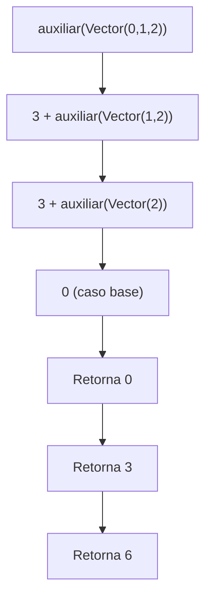
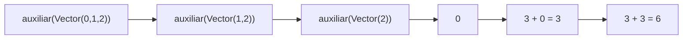
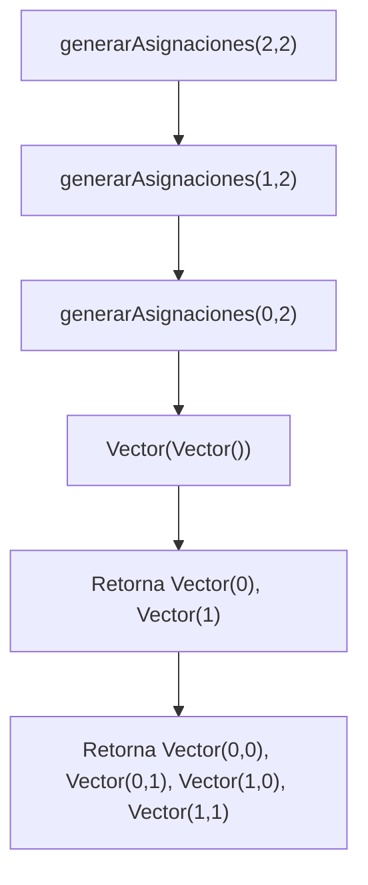
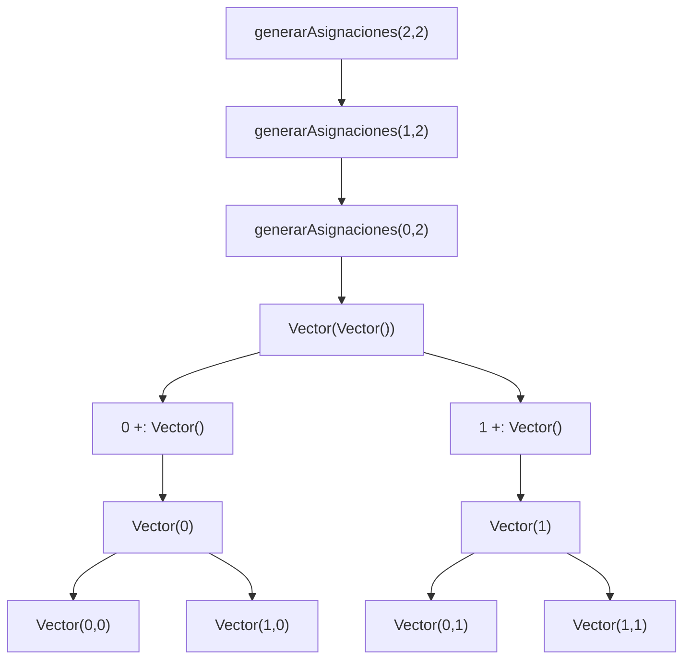
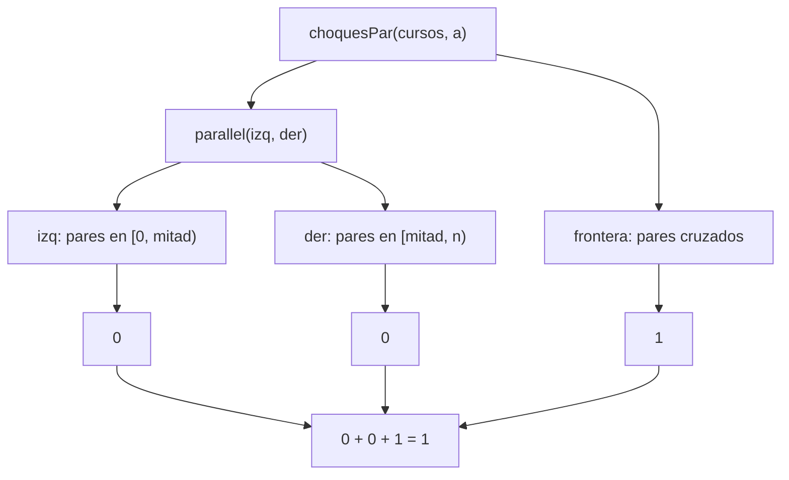
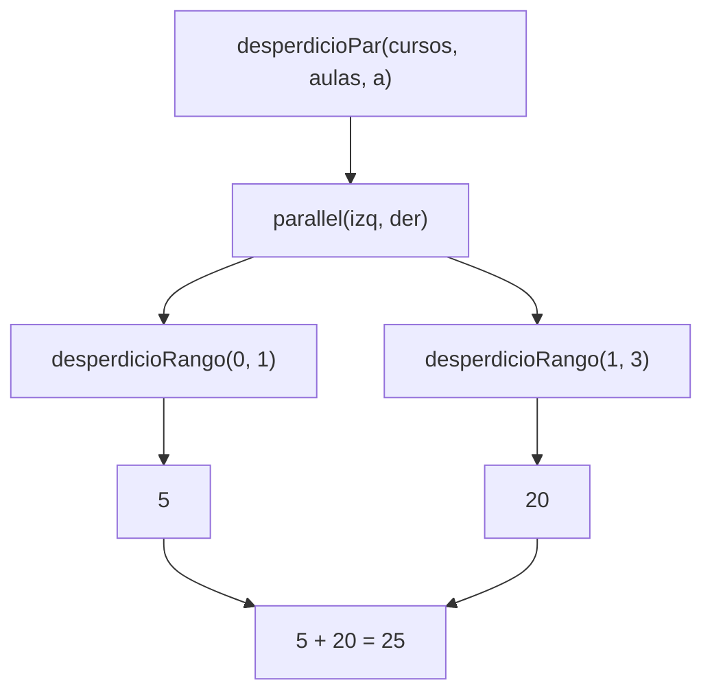
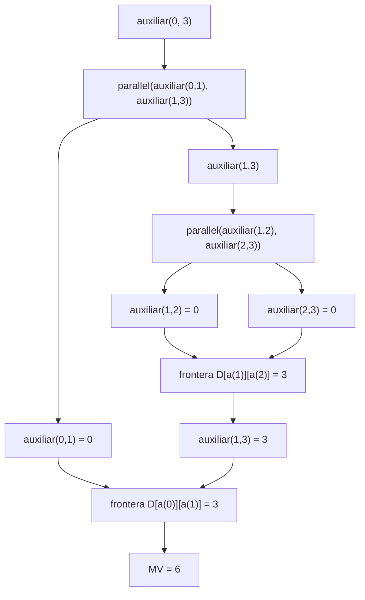
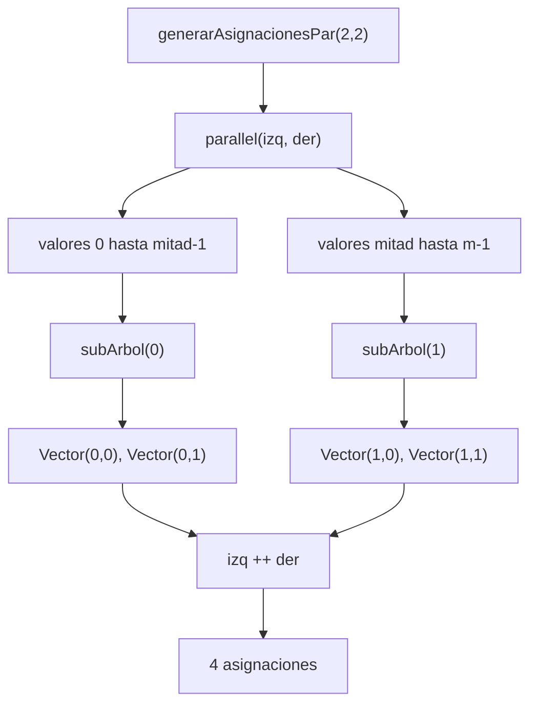
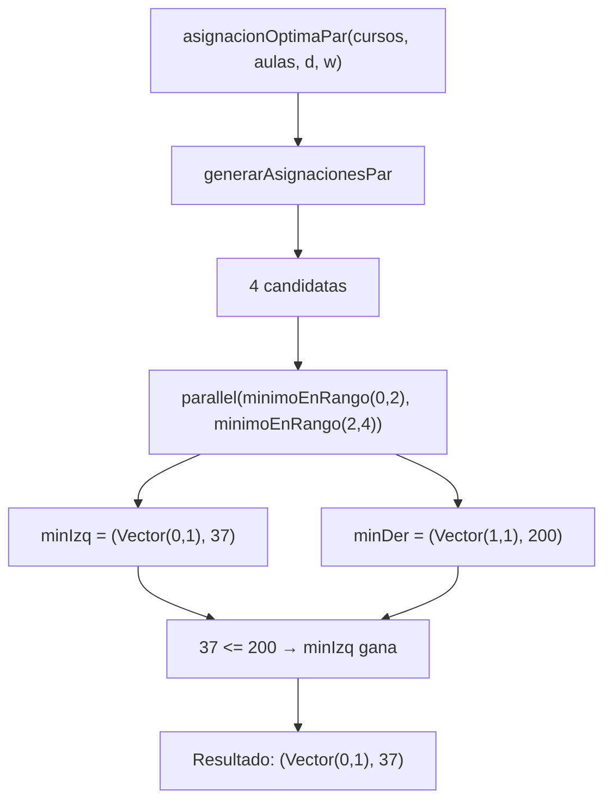

# Informe de Proceso

## Función `movilidad`

### Objetivo

La función `movilidad` calcula la distancia total recorrida entre aulas cuando los cursos se ordenan cronológicamente según su hora de inicio.

Para ello:

1. Filtra únicamente los cursos asignados.
2. Los ordena por hora de inicio.
3. Recorre recursivamente la secuencia sumando las distancias entre aulas consecutivas.

La recursión se encuentra en la función auxiliar:

```scala
def auxiliar(indices: Vector[Int]): Int =
  indices match {
    case i1 +: i2 +: resto =>
      d(a(i1))(a(i2)) + auxiliar(i2 +: resto)
    case _ => 0
  }
```

---

### Ejemplo

Supóngase:

```scala
val cursos = Vector(
  ("M01", 4, 8, 25),
  ("M02", 6, 10, 30),
  ("M03", 12, 16, 20)
)

val a = Vector(0,1,0)

val d = Vector(
  Vector(0,3),
  Vector(3,0)
)
```

Después del ordenamiento cronológico:

```scala
ordenCursos = Vector(0,1,2)
```

La movilidad esperada es:

$$
D(0,1)+D(1,0)
=
3+3
=
6
$$

---

### Pila de llamadas



---

### Desarrollo paso a paso

#### Llamada inicial

```scala
auxiliar(Vector(0,1,2))
```

Reconoce el patrón:

```scala
i1 = 0
i2 = 1
resto = Vector(2)
```

Calcula:

```scala
d(0)(1) + auxiliar(Vector(1,2))
```

Resultado parcial:

$$  
3 + auxiliar(Vector(1,2))  
$$

---

#### Segunda llamada

```scala
auxiliar(Vector(1,2))
```

Reconoce:

```scala
i1 = 1
i2 = 2
resto = Vector()
```

Calcula:

```scala
d(1)(0) + auxiliar(Vector(2))
```

Resultado parcial:

$$  
3 + auxiliar(Vector(2))  
$$

---

#### Caso base

```scala
auxiliar(Vector(2))
```

Solo queda un elemento.

Se activa:

```scala
case _ => 0
```

Retorna:

$$  
0  
$$

---

#### Retorno

Segunda llamada:

$$  
3 + 0 = 3  
$$

Primera llamada:

$$  
3 + 3 = 6  
$$

Resultado final:

$$  
MV = 6  
$$

---

### Diagrama Mermaid



---

### Ventajas de la solución

- Utiliza reconocimiento de patrones.
- Evita variables mutables.
- La definición recursiva coincide directamente con la definición matemática:

$$  
MV =  
\sum_{i=1}^{n-1}  
D(i,i+1)  
$$

---

## Función `generarAsignaciones`

### Objetivo

Generar todas las asignaciones posibles de aulas para los cursos.

Cada asignación es un vector cuyos valores pertenecen al conjunto:

$$  
{0,\ldots,m-1}  
$$

Si existen:

- $n$ cursos
- $m$ aulas

entonces deben generarse:

$$  
m^n  
$$

asignaciones.

---

### Estrategia utilizada

La función emplea recursión estructural sobre el número de cursos.

```scala
if (n == 0)
  Vector(Vector())
```

corresponde al caso base.

Para el caso recursivo:

```scala
generarAsignaciones(n - 1, m)
```

genera todas las asignaciones de longitud menor.

Posteriormente se agregan todas las posibles aulas al inicio de cada asignación parcial.

---

### Ejemplo

```scala
generarAsignaciones(2,2)
```

Las aulas posibles son:

```scala
0
1
```

Por lo tanto deben generarse:

$$  
2^2 = 4  
$$

asignaciones.

---

### Pila de llamadas



---

### Desarrollo paso a paso

#### Caso base

```scala
generarAsignaciones(0,2)
```

Retorna:

```scala
Vector(Vector())
```

Representa la única asignación posible para cero cursos.

---

#### Retorno a n = 1

La recursión recibe:

```scala
Vector(Vector())
```

Se agregan todas las aulas posibles:

```scala
0 +: Vector()
1 +: Vector()
```

Resultado:

```scala
Vector(
  Vector(0),
  Vector(1)
)
```

---

#### Retorno a n = 2

La recursión recibe:

```scala
Vector(
  Vector(0),
  Vector(1)
)
```

Ahora se agregan nuevamente todas las aulas posibles.

Para aula 0:

```scala
Vector(0,0)
Vector(0,1)
```

Para aula 1:

```scala
Vector(1,0)
Vector(1,1)
```

Resultado final:

```scala
Vector(
  Vector(0,0),
  Vector(0,1),
  Vector(1,0),
  Vector(1,1)
)
```

---

### Diagrama Mermaid



---

### Relación con programación funcional

La construcción final utiliza funciones de alto orden:

```scala
flatMap
```

y

```scala
map
```

- `map` genera nuevas asignaciones agregando una aula al frente.
- `flatMap` concatena todas las asignaciones producidas para cada aula.
- La combinación de ambas funciones permite construir el producto cartesiano sin utilizar ciclos imperativos.

---

### Complejidad

Para cada una de las $m^n$ asignaciones generadas se construye un vector de longitud $n$.

Por tanto:

$$  
T(n)=O(m^n)  
$$

Esta complejidad es inevitable, ya que el problema exige enumerar explícitamente todas las asignaciones posibles.

# Función `solapan`

## Objetivo

Determinar si dos cursos se traslapan en el tiempo.

```scala
def solapan(c1: Curso, c2: Curso): Boolean =
  iniCurso(c1) < finCurso(c2) &&
  iniCurso(c2) < finCurso(c1)
```

## Estrategia utilizada

Dos intervalos:

$$
[ini_1,fin_1)
$$

y

$$
[ini_2,fin_2)
$$

se traslapan cuando:

$$
ini_1 < fin_2
$$

y

$$
ini_2 < fin_1
$$

La función evalúa exactamente estas dos condiciones.

## Ejemplo

```scala
c1 = ("M01",4,8,25)
c2 = ("M02",6,10,30)
```

Evaluación:

$$
4 < 10
$$

$$
6 < 8
$$

Ambas son verdaderas.

Resultado:

```scala
true
```

## Complejidad

$$
O(1)
$$

---

# Función `choques`

## Objetivo

Contar cuántos pares de cursos:

- comparten aula,
- están asignados,
- y se traslapan.

```scala
def choques(cursos: Cursos, a: Asignacion): Int =
  cursos.indices.flatMap { i =>
    (i + 1 until cursos.length).map { j => (i, j) }
  }.count { case (i, j) =>
    a(i) >= 0 && a(i) == a(j) && solapan(cursos(i), cursos(j))
  }
```

## Estrategia utilizada

La función genera todos los pares:

$$
(i,j)
$$

tales que:

$$
i < j
$$

utilizando:

```scala
flatMap
```

Posteriormente utiliza:

```scala
count
```

para contabilizar únicamente aquellos pares que cumplen las restricciones del problema.

## Ejemplo

```scala
Cursos:
M01 4-8
M02 6-10

Asignación:
Vector(0,0)
```

Los cursos usan la misma aula y se traslapan.

Resultado:

$$
CH = 1
$$

## Complejidad

Se generan todos los pares posibles:

$$
\frac{n(n-1)}{2}
$$

Por tanto:

$$
O(n^2)
$$

---

# Función `capacidadFallida`

## Objetivo

Contar los cursos cuya aula asignada no tiene suficiente capacidad.

```scala
def capacidadFallida(cursos: Cursos, aulas: Aulas, a: Asignacion): Int =
  cursos.indices.count { i =>
    a(i) >= 0 && capAula(aulas(a(i))) < estCurso(cursos(i))
  }
```

## Estrategia utilizada

Se recorren todos los cursos mediante:

```scala
count
```

y se verifica:

$$
capacidad(aula_i) < estudiantes(curso_i)
$$

## Ejemplo

```scala
Curso:
40 estudiantes

Aula:
30 puestos
```

Entonces:

$$
30 < 40
$$

Resultado:

$$
CF = 1
$$

## Complejidad

$$
O(n)
$$

---

# Función `desperdicio`

## Objetivo

Calcular la cantidad total de puestos vacíos.

```scala
def desperdicio(cursos: Cursos, aulas: Aulas, a: Asignacion): Int =
  cursos.indices.foldLeft(0) { (acc, i) =>
    if (a(i) >= 0 && capAula(aulas(a(i))) >= estCurso(cursos(i)))
      acc + (capAula(aulas(a(i))) - estCurso(cursos(i)))
    else acc
  }
```

## Estrategia utilizada

La función utiliza:

```scala
foldLeft
```

para acumular los puestos libres de cada aula válida.

Para cada curso asignado se calcula:

$$
capacidad - estudiantes
$$

y se suma al acumulador.

## Ejemplo

```scala
Curso:
25 estudiantes

Aula:
30 puestos
```

Desperdicio:

$$
30 - 25 = 5
$$

## Complejidad

$$
O(n)
$$

---

# Función `costoAsignacion`

## Objetivo

Calcular el costo total de una asignación.

```scala
def costoAsignacion(...)
```

## Fórmula utilizada

$$
Costo =
w_{CH}CH +
w_{CF}CF +
w_{DE}DE +
w_{MV}MV
$$

## Ejemplo

Supóngase:

$$
CH = 1
$$

$$
CF = 0
$$

$$
DE = 10
$$

$$
MV = 6
$$

y:

$$
w = (1000,100,1,2)
$$

Entonces:

$$
Costo =
1000(1) +
100(0) +
1(10) +
2(6)
$$

$$
1000 + 0 + 10 + 12
$$

$$
1022
$$

## Complejidad

La complejidad está dominada por la función:

```scala
choques
```

Por tanto:

$$
O(n^2)
$$

---

# Función `asignacionOptima`

## Objetivo

Encontrar la asignación con menor costo.

```scala
def asignacionOptima(cursos: Cursos,
                     aulas: Aulas,
                     d: Distancias,
                     w: Pesos): (Asignacion, Int)
```

## Estrategia utilizada

La función:

1. Genera todas las asignaciones posibles.
2. Calcula el costo de cada una.
3. Conserva la mejor mediante un `foldLeft`.

```scala
asignacionesPosibles.foldLeft((Vector[Int](), Int.MaxValue))
```

## Ejemplo

Supóngase:

```scala
Vector(0,0)
```

con costo:

$$
100
$$

y:

```scala
Vector(0,1)
```

con costo:

$$
20
$$

Como:

$$
20 < 100
$$

la segunda asignación se convierte en la mejor.

## Desarrollo paso a paso

Estado inicial:

```scala
(Vector(), Int.MaxValue)
```

Primera asignación:

```scala
(Vector(0,0),100)
```

Segunda asignación:

```scala
(Vector(0,1),20)
```

Como:

$$
20 < 100
$$

se actualiza la mejor solución.

Resultado final:

```scala
(Vector(0,1),20)
```

## Complejidad

Si existen:

$$
m^n
$$

asignaciones posibles, todas deben evaluarse.

Por tanto:

$$
O(m^n)
$$

---

## Función `choquesPar`

### Objetivo

Calcular el número de choques de horario de forma paralela, dividiendo el vector de cursos en dos mitades y evaluando cada mitad en una tarea independiente.

### Estrategia de paralelización

El espacio de pares $(i,j)$ con $i < j$ se divide en tres zonas:

- **Mitad izquierda**: pares donde tanto $i$ como $j$ pertenecen a $[0, mitad)$
- **Mitad derecha**: pares donde tanto $i$ como $j$ pertenecen a $[mitad, n)$
- **Frontera**: pares donde $i \in [0, mitad)$ y $j \in [mitad, n)$

Las dos mitades se calculan en paralelo con `parallel`. La frontera se calcula secuencialmente porque cruza ambas mitades.

```scala
val (izq, der) = parallel(
  // pares dentro de la mitad izquierda
  ...,
  // pares dentro de la mitad derecha
  ...
)
val frontera = // pares cruzados
izq + der + frontera
```

### Ejemplo

```scala
val cursos = Vector(
  ("M01", 4, 8, 25),
  ("M02", 6, 10, 30),
  ("M03", 12, 16, 20)
)
val a = Vector(0, 0, 1)
```

Con $n = 3$ y $mitad = 1$:

- **Izquierda** $[0,1)$: no hay pares posibles con $i < j$ dentro de un solo elemento $\Rightarrow 0$
- **Derecha** $[1,3)$: par $(1,2)$, aulas $0 \neq 1$ $\Rightarrow 0$
- **Frontera**: par $(0,1)$, misma aula $0 = 0$, se solapan $\Rightarrow 1$

$$
CH = 0 + 0 + 1 = 1
$$

### Diagrama Mermaid



---

## Función `desperdicioPar`

### Objetivo

Calcular el desperdicio total de capacidad dividiendo los cursos en dos mitades evaluadas en paralelo.

### Estrategia de paralelización

A diferencia de `choquesPar`, el desperdicio es una suma independiente por curso: no hay interacción entre cursos. Por tanto la división es limpia, sin zona de frontera.

```scala
val (izq, der) = parallel(
  desperdicioRango(0, mitad),
  desperdicioRango(mitad, n)
)
izq + der
```

La función auxiliar `desperdicioRango(inicio, fin)` calcula el desperdicio de los cursos en el rango $[inicio, fin)$.

### Ejemplo

```scala
val cursos = Vector(
  ("M01", 4, 8, 25),
  ("M02", 6, 10, 30),
  ("M03", 12, 16, 20)
)
val aulas = Vector(("E101", 30), ("E102", 40))
val a     = Vector(0, 0, 1)
```

Con $n = 3$ y $mitad = 1$:

- **Izquierda** $[0,1)$: M01 en E101 $\Rightarrow 30 - 25 = 5$
- **Derecha** $[1,3)$: M02 en E101 $\Rightarrow 30 - 30 = 0$, M03 en E102 $\Rightarrow 40 - 20 = 20$

$$
DE = 5 + 0 + 20 = 25
$$

### Diagrama Mermaid



---

## Función `movilidadPar`

### Objetivo

Calcular el costo de movilidad de forma paralela, dividiendo recursivamente la secuencia de cursos ordenados.

### Estrategia de paralelización

A diferencia del desperdicio, la movilidad **sí tiene interacción entre mitades**: la distancia entre el último curso de la mitad izquierda y el primero de la derecha debe calcularse explícitamente como frontera.

```scala
val (izq, der) = parallel(
  auxiliar(inicio, mitad),
  auxiliar(mitad, fin)
)
val frontera = d(a(ordenados(mitad - 1)))(a(ordenados(mitad)))
izq + der + frontera
```

### Ejemplo

```scala
val cursos = Vector(
  ("M01", 4, 8, 25),
  ("M02", 6, 10, 30),
  ("M03", 12, 16, 20)
)
val a = Vector(0, 1, 0)
val d = Vector(Vector(0,3), Vector(3,0))
```

Orden cronológico: $[0, 1, 2]$ (M01, M02, M03).

Con $inicio=0$, $fin=3$, $mitad=1$:

- **Izquierda** $[0,1)$: un solo elemento $\Rightarrow 0$
- **Derecha** $[1,3)$: $D[1][0] = 3$
- **Frontera**: $D[a(0)][a(1)] = D[0][1] = 3$

$$
MV = 0 + 3 + 3 = 6
$$

### Diagrama Mermaid



---

## Función `generarAsignacionesPar`

### Objetivo

Generar todas las asignaciones posibles en paralelo, dividiendo los valores del primer curso en dos mitades y construyendo cada subárbol de forma independiente.

### Estrategia de paralelización

El espacio de asignaciones se divide según el valor asignado al primer curso. Si hay $m$ aulas, los valores $[0, mitad)$ se procesan en una tarea y $[mitad, m)$ en otra.

```scala
val (izq, der) = parallel(
  (0 until mitad).toVector.flatMap(subArbol),
  (mitad until m).toVector.flatMap(subArbol)
)
izq ++ der
```

Cada `subArbol(v)` genera todas las asignaciones de longitud $n-1$ y les antepone el valor $v$, llamando a `generarAsignaciones` (secuencial) para los cursos restantes.

### Ejemplo

```scala
generarAsignacionesPar(2, 2)
```

Con $mitad = 1$:

- **Izquierda**: valor $0$ $\Rightarrow$ `Vector(0,0)`, `Vector(0,1)`
- **Derecha**: valor $1$ $\Rightarrow$ `Vector(1,0)`, `Vector(1,1)`

$$
2^2 = 4 \text{ asignaciones}
$$

### Diagrama Mermaid



---

## Función `asignacionOptimaPar`

### Objetivo

Encontrar la asignación de mínimo costo dividiendo el espacio de candidatos en dos mitades evaluadas en paralelo.

### Estrategia de paralelización

El vector de candidatas generado por `generarAsignacionesPar` se divide en dos mitades. Cada mitad busca su mínimo local con `minimoEnRango`. Los dos mínimos se comparan al final.

```scala
val (minIzq, minDer) = parallel(
  minimoEnRango(0, mitad),
  minimoEnRango(mitad, candidatas.length)
)
if (minIzq._2 <= minDer._2) minIzq else minDer
```

### Ejemplo

Supóngase 4 candidatas con costos:

| Asignación | Costo |
|---|---|
| `Vector(0,0)` | 1031 |
| `Vector(0,1)` | 37 |
| `Vector(1,0)` | 500 |
| `Vector(1,1)` | 200 |

Con $mitad = 2$:

- **Izquierda** $[0,2)$: mínimo entre 1031 y 37 $\Rightarrow$ `(Vector(0,1), 37)`
- **Derecha** $[2,4)$: mínimo entre 500 y 200 $\Rightarrow$ `(Vector(1,1), 200)`

Como $37 < 200$:

$$
a^* = \text{Vector}(0,1),\quad c^* = 37
$$

### Diagrama Mermaid

